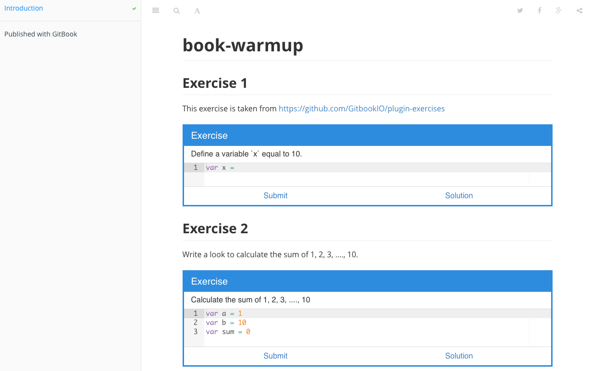

# Pre-class Warmup Learning Challenge

This is a warmup learning challenge designed to help you refresh these skills
and also to get you prepared for our first meeting.

## Objectives

There are certain expectations about your skills and background you should have
obtained from the pre-requisite courses.

* Github
* Javascript
* node.js
* npm
* gitbook

## Due

4pm Monday, August 24 (before the class starts)

## Expected time

30 minutes - 1 Hour

## Tasks

Your challenge is to perform the following tasks:

1. Introduce yourself at the [course
forum](https://github.com/bigdatahci2015/forum/issues/1) (which is an issue
tracker of a repository on Github) by leaving a comment following the example
(name, department, favorite programming language, favorite food).

2. Make sure you have [node.js](https://nodejs.org/) and
[npm](https://docs.npmjs.com/getting-started/installing-node) installed on your
laptop. You will need to bring your laptop to the class each week to participate
in the in-class hackathon.

3. We will use [gitbook](https://github.com/GitbookIO/gitbook) extensively to facility learning challenge and
hackathons. Fork the [warmup
gitbook](https://github.com/bigdatahci2015/book-warmup). Clone locally on your
computer. Read [gitbook](https://github.com/GitbookIO/gitbook) to figure out how you can install the plugin specified
in `book.json` and serve the book locally on your own computer. If you succeed,
you should be able to see something like below

    

4. This warmup gitbook contains two Javascript exercises using the
[exercises plugin](https://github.com/GitbookIO/plugin-exercises). The second
exercise is incomplete. The solution is still missing. Can you complete this
exercise? Once you did, commit and push your changes to your own fork. Then
make a pull request.

Once you have completed the four tasks above, you should have refreshed your skills
and knowledge about Github, Javascript, node.js, npm, and also learned something new about
[gitbook](https://github.com/GitbookIO/gitbook).

## Submission

If you have successfully made a pull request, your submission will show up on
[this page](https://github.com/bigdatahci2015/book-warmup/pulls), which lists
all the pull requests made to it. This will be the default submission mechanism
you will use a lot this semester.

## Extra Challenge (Optional)

For those of you who are more ambitious, try to publish your warmup gitbook to
[gh-pages](https://pages.github.com/). You can either follow the [official instructions](https://help.github.com/articles/creating-project-pages-manually/) or use the
`git subtree` technique.

    $ git subtree push --prefix _book origin gh-pages

Note that the folder `_book` is where gitbook outputs all the generated files
for the book when you run `gitbook build`. It would be interesting to find out how many
students opt to take on this extra challenge prior to our first meeting.
